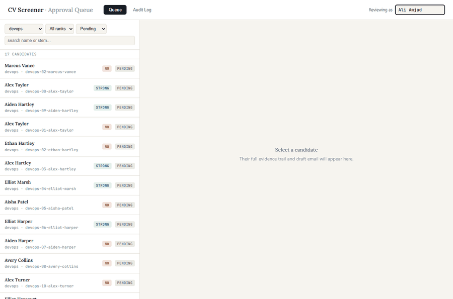
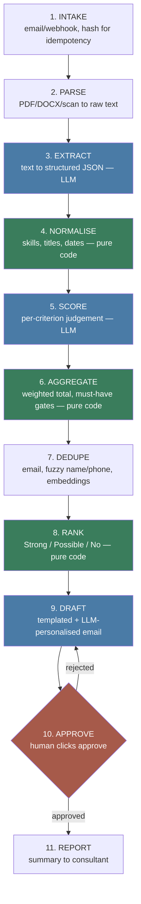
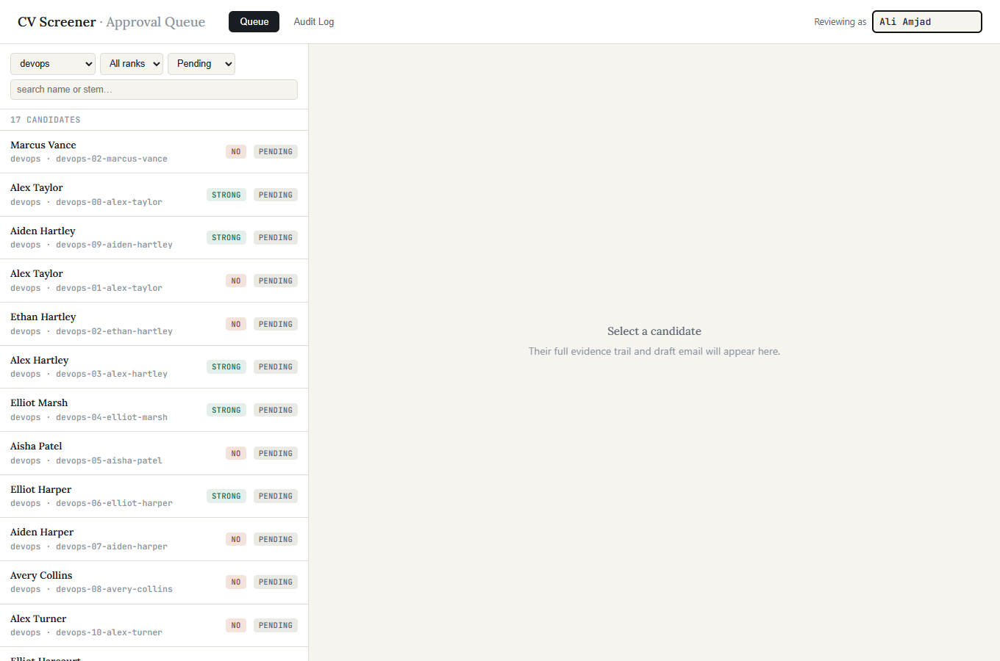
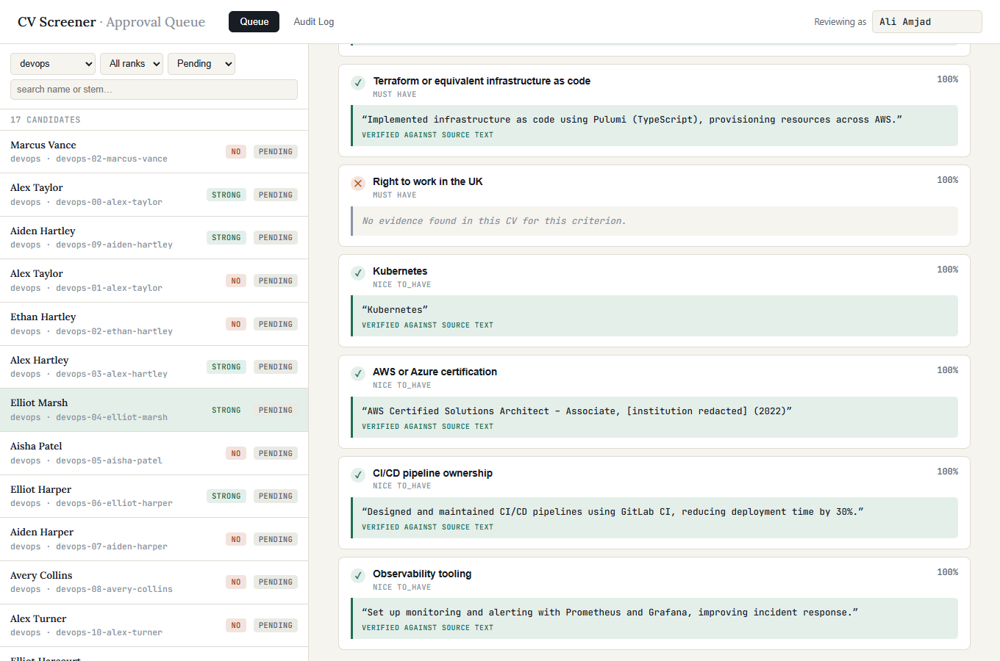
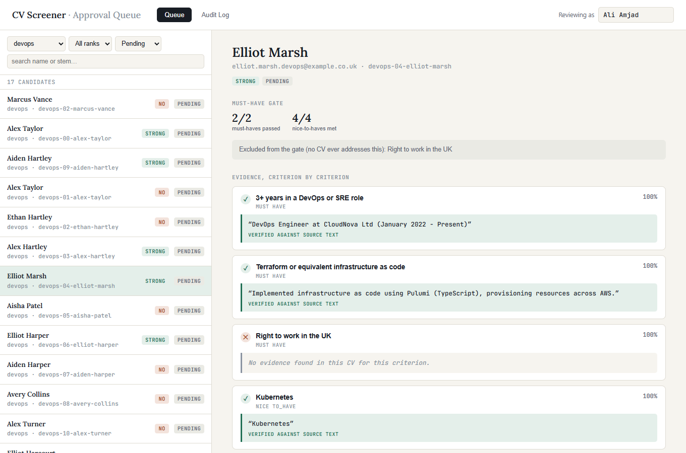
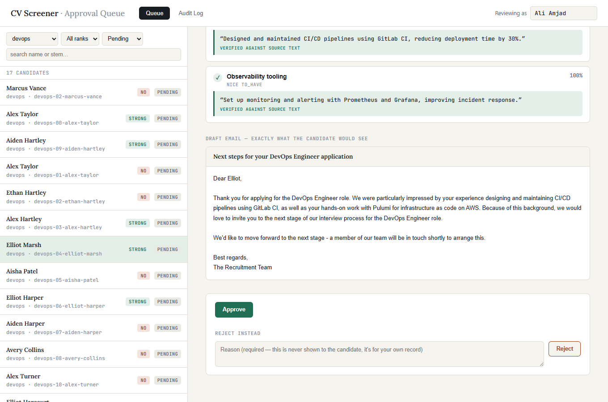
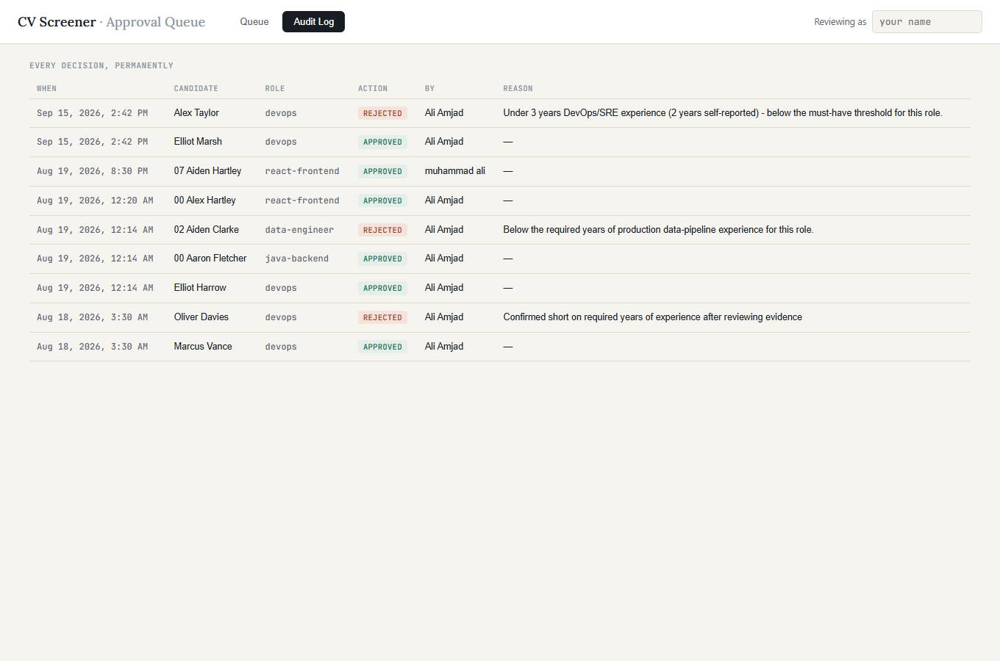

# CV Screener

A CV screening pipeline for small UK IT recruitment agencies (3–30 staff) — built so every application actually gets read, every judgement is checkable, and nothing is sent to a candidate without a human clicking approve.

## The problem this solves

An agency posts a role and gets ~200 applications over five days. A resourcer opens each one, skims it for about ten seconds, and decides. That's roughly three hours of work per role — the last forty CVs get less attention than the first forty, and a large share of candidates never hear back at all.

This system reads all 200. It parses every CV, scores each one against the role's actual requirements with reasoning a human can inspect, flags people who've applied to several roles under slightly different details, and drafts a personalised reply. **A human on the agency's team approves every decision before anything sends. The system never rejects and it never sends, on its own, ever.**



## What's actually in here

- **Schema-enforced LLM output** on every model call (Pydantic contracts, strict mode), across two different providers with genuinely different constraints — not just one API wrapped once
- **Evaluation harnesses graded against ground truth**, not eyeballed — extraction accuracy, evidence-quote verification, and duplicate-detection precision/recall all come from `evals/`, with dated, committed reports
- **A cascading matching strategy for deduplication** — cheap checks first (exact email, fuzzy name/phone), an expensive embedding-similarity check only where the cheap ones disagree, because naive fuzzy matching alone had a measured 97% false-positive rate on this dataset
- **Rate-limit and quota hardening earned the hard way** — this repo hit three separate undocumented daily caps across two providers during real runs, and the fix each time is in the commit history and `docs/LEARNING.md`, not hypothetical
- **A human-in-the-loop system built around a real legal constraint** (UK GDPR Article 22), not just a "nice to have" button — an audit trail nothing can rewrite, and a decision gate that refuses to let itself be bypassed even for testing
- **Live infrastructure**, not just scripts: Docker, a visual n8n workflow, a Postgres/Supabase backend, a FastAPI service, and a small dashboard built to make every decision's evidence inspectable

## The one design decision everything else follows from

The AI is only ever asked to make one small judgement at a time — never a final call. For one candidate, against one requirement, it returns a yes/no verdict, a confidence score, and the exact quoted sentence from the CV that supports it. It never adds anything up, ranks anyone, or decides who gets rejected.

All of the arithmetic — turning per-criterion verdicts into a rank — is ordinary, deterministic Python. An LLM asked to "score this CV" gives a slightly different answer each time and can't show its work; a director who disagrees with a shortlist needs a reason they can check, not "the model said so."



Blue touches an LLM. Green is pure code — deterministic, re-runnable, no model involved. Orange is the human gate: nothing downstream happens automatically. Full stage-by-stage detail, including what broke and how it was fixed, is in [`docs/ARCHITECTURE.md`](docs/ARCHITECTURE.md).

## Screenshots

**The queue** — every candidate, ranked, waiting for a decision:


**The evidence** — every claim traces to an exact quoted sentence from the real CV:


**Handling the edge case** — a must-have with no evidence anywhere gets excluded from the gate, not silently failed:


**The decision point** — nothing sends until a person clicks:


**The permanent record** — every decision, who made it, when:


## How a human actually approves something

Every draft lands in a queue with status `pending` and stays there until a person decides. Two ways to review the queue exist today:

- **A dashboard** (`src/api.py` serves it at `/`) — a two-pane view: the queue on the left, filterable by role/rank/status; the full evidence trail on the right (every criterion, its confidence, its exact quoted proof, a verified badge) plus the draft email exactly as the candidate would see it, and Approve/Reject at the bottom.
- **A local CLI** (`src/approve.py`) — the same logic, for scripting or a quick terminal check: `list`, `show`, `approve --by "name"`, `reject --by "name" --reason "..."`.

Either way, approving only changes a status and logs who/when — it does not send anything. Every decision is also written to an append-only audit log that nothing in the codebase is allowed to edit or delete afterward, and re-deciding an already-decided draft is refused outright, not silently overwritten (tested directly, both interfaces). This exists because UK GDPR Article 22 restricts decisions made solely by automated means where they significantly affect someone — a rejection plausibly qualifies — and because visible, overridable reasoning is the actual thing being sold here, not a black box.

## Measured results

Every number below came from a real run against the current synthetic dataset (62 candidates, 4 roles, regenerated 2026-08-19) — not an estimate. Full reports: [`evals/results/`](evals/results/).

**Extraction** (raw CV text → structured JSON):
- Every contact/identity field (name, email, phone, location, current title): 100% (62/62)
- Skills (set F1) and personal statement similarity: both ~1.00 average
- Employment and education entries: 100% matched (149/149, 67/67)
- Weak point, known and unhidden: `total_years_experience` at 53.2% (33/62) — this is arithmetic over employment dates, not something stated verbatim in a CV, and the model isn't reliable at computing it. `NORMALISE` exists specifically to take that computation away from the LLM in a future pass.

**Scoring** (per-criterion judgement, 450 judgements across all 4 roles):
- 99.6% of evidence quotes verified as genuinely present in the CV text the model was shown (448/450) — the other 2 were borderline multi-line quotes, not invented facts
- Must-have pass rate tracks intended candidate quality correctly in every role (e.g. devops: strong 66.7% → medium 33.3% → weak 8.3%)

**Dedupe** (catching the same person applying under a different name/email):
- Naive fuzzy name+phone matching alone: 97% false-positive rate on this dataset (name/phone collisions between unrelated people are far more common than intuition suggests)
- Adding an embedding-based content-similarity check on top: 5 of 6 planted duplicates caught, 0 false positives, at a similarity threshold of 0.999

**Full pipeline run**: 62/62 extracted, 62/62 scored, 62/62 drafted — zero candidates lost to an unrecovered failure. Result: 27 Strong, 1 Possible, 34 No.

## Stack

| Layer | Choice |
|---|---|
| Orchestration | n8n Community Edition, self-hosted in Docker |
| Service | FastAPI |
| Storage | Supabase Postgres (+ pgvector for dedupe embeddings) |
| Models | Gemini and Groq, both free-tier, switchable with one setting |
| Parsing | pdfplumber, PyMuPDF, python-docx (real-CV parsing; test data is fully synthetic) |

**Runs on free tiers, deliberately.** No paid API, no paid hosting. That's also a sales line: this costs a few dollars a month to run, not per-seat SaaS pricing.

Two LLM providers are wired up because neither one's free tier turned out generous enough alone for a full run at this scale, and each binds on a different axis: Groq caps total *tokens* per day (200,000 on the model used here — exhausted by well under 100 calls given this pipeline's token-heavy prompts), Gemini's `flash-lite` caps total *requests* per day (500). `LLM_PROVIDER=gemini` or `LLM_PROVIDER=groq` in `.env` — or as a one-off `LLM_PROVIDER=groq python src/whatever.py` — switches every LLM call in the codebase, no code edits required.

## Running it locally

```bash
python -m venv .venv && source .venv/bin/activate   # or .venv\Scripts\activate on Windows
pip install -r requirements.txt
cp .env.example .env   # fill in GEMINI_API_KEY / GROQ_API_KEY / SUPABASE_DB_URL

python src/generate_cvs.py                 # synthetic test CVs (never real candidate data)
python src/extract.py
python src/score.py --role devops
python src/draft.py --role devops

python src/approve.py list                 # review + decide from the terminal
```

For the live version (visual n8n workflow + Supabase-backed queue + dashboard):

```bash
docker compose up -d          # starts n8n on :5678
cd src && uvicorn api:app --port 8000   # dashboard + API at :8000
python src/sync_to_live.py    # pushes any local batch results into the live queue
```

## Honest limitations

- **Nothing actually sends an email yet.** Approval changes a status and logs it — the "send it for real" step is a deliberate gap, not an oversight, and needs its own decision about how that stays human-gated too.
- **Fully sequential, no concurrency.** Correct, but slower than it needs to be at real scale (200 CVs).
- **Dedupe isn't wired into the live system.** It runs as a standalone local script; the live `candidates` table has no duplicate flag yet, so the dashboard can't currently surface "this person already applied elsewhere."
- **No quota visibility.** Both providers' daily limits have been hit mid-run more than once during development, each time as a surprise. A usage tracker doesn't exist yet.
- **`total_years_experience` extraction is genuinely weak** (53.2%) — documented above, not smoothed over.
- Test data is 100% synthetic, generated by `src/generate_cvs.py`. No real candidate CV has ever been processed by this system.

## Repo layout

```
cv-screener/
├── src/            pipeline stages, the FastAPI service, the dashboard
├── data/           synthetic CVs, ground truth, pipeline output (gitignored except job_specs.json)
├── evals/          dated, committed eval reports — every number in this README traces back here
├── supabase/       schema for the live Postgres-backed queue
└── docs/
    ├── ARCHITECTURE.md   full stage-by-stage breakdown, with a diagram
    ├── LEARNING.md       a dated build log — what broke, what fixed it, why
    └── GLOSSARY.md       every technical term used in this repo, one line each
```
