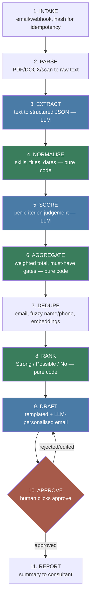

# Architecture

## Why the pipeline is split into eleven stages

The core design decision in this system: **the model makes one judgement at a time, and code does everything else.** Scoring maths, ranking, retries, deduplication logic — none of it is delegated to an LLM, because an LLM asked to do arithmetic or hold state across a batch is unreliable and unauditable. A director who disagrees with a shortlist needs a reason they can inspect, not "the model said so."

That split is why there are eleven stages instead of "an LLM reads the CV and returns a verdict." Three of them (NORMALISE, AGGREGATE, RANK) contain no LLM call at all, on purpose.

Blue = touches an LLM. Green = pure code, no LLM, deterministic and re-runnable. Orange = the human gate — nothing downstream of it happens automatically.

## Stage by stage

**1. INTAKE** — An email or webhook delivers attachments. Each file gets hashed on arrival so the same CV received twice (a candidate re-sending, a webhook retry) is recognised and not processed twice. No LLM.

**2. PARSE** — Convert whatever file format arrives (PDF, DOCX, scanned image) into raw text. `pdfplumber`/`PyMuPDF` for PDFs, `python-docx` for Word, Tesseract OCR for scans. No LLM — this is mechanical text extraction, and if it fails, the CV goes to the human review queue with a reason rather than being silently dropped (rule 6 in CLAUDE.md).

**3. EXTRACT** — LLM call. Raw CV text in, a schema-enforced JSON object out (the `CandidateProfile` shape already defined in `generate_cvs.py`: name, contact, employment history, education, skills, etc). This is the first LLM boundary and the one `evals/extraction_eval.py` will grade, because `data/ground_truth/` gives us the exact right answer for every synthetic CV.

**4. NORMALISE** — Pure code. Cleans up what extraction returns: skill synonyms ("JS" and "Javascript" are the same skill), job title normalisation, date parsing, computing employment gaps. Deterministic, no LLM, because this is lookup-table and string-parsing work — asking a model to do it would be slower, costlier, and less consistent. Confirmed by the Day 2 eval (`docs/LEARNING.md`): asking extraction to also estimate `total_years_experience` scored 74.2%, the one real weak point in an otherwise near-perfect run, because it's arithmetic over `employment[].start`/`end` dates, not something stated verbatim in the CV. This stage exists specifically to compute that kind of value in code instead.

**5. SCORE** — LLM call, but narrow. For one candidate against one rubric criterion at a time, the model returns a verdict (pass/fail or a rating), a confidence, and a quoted piece of evidence from the CV. It does not produce a final score — that would mean re-running the whole judgement to check its own maths, and it would drift between runs. One criterion in, one verdict out, repeated per criterion. Every open-ended employment date ("... - Present") needs today's date given to the model explicitly, confirmed by a Day 3 bug (`docs/LEARNING.md`): without it, the model silently guesses its own notion of "now" rather than computing the real span.

**6. AGGREGATE** — Pure code (`src/aggregate.py`). Takes all the per-criterion verdicts from SCORE and does the arithmetic: binary gates for must-haves (any failed must-have caps the candidate, however good the rest of the CV is), a plain count for nice-to-haves. The Day 3 problem with "Right to work in the UK" (zero textual evidence in any CV, so it would auto-fail every candidate) is resolved generically, not by hardcoding that criterion's name: any must-have with zero evidence across *every* scored candidate for a role is excluded from the gate and flagged separately as "needs confirmation" — a rule that would also catch any other CV-unanswerable must-have a future rubric introduces, not just this one. Nice-to-have weighting is still a placeholder (a flat "2+ met = Strong" cutoff, not the weighted config CLAUDE.md's pipeline description calls for) — not built because no agency has asked for specific weights yet.

**7. DEDUPE** — Catches the same person applying to multiple roles under slightly different details (a shortened name, a different email — see the duplicate-planting logic in `generate_cvs.py`). Cascades from cheap to expensive: exact email match and fuzzy name+phone matching first (pure code, effectively free even at scale), then embedding-based content similarity to confirm or reject what the cheap stage flagged. Embeddings are not optional here, confirmed by measurement (`docs/LEARNING.md` Day 4): fuzzy name+phone alone, run across all 62 synthetic candidates, flagged 207 pairs for only 6 real duplicates — a 97% false-positive rate, because names and phone numbers collide between genuinely unrelated people far more than intuition suggests (24 different fake candidates all named "Oliver Vance" in this dataset alone). The embedding step compares actual CV content, not contact details, and cleanly separated true duplicates (similarity 1.0000) from same-named strangers (similarity ≤ 0.9958) — a real, wide gap, not a fuzzy judgement call.

**8. RANK** — Pure code, folded into `rank_candidate()` in `src/aggregate.py` alongside AGGREGATE (they're small enough that splitting them into separate files bought nothing yet). Sorts candidates into Strong / Possible / No, with the full per-criterion breakdown kept visible — nothing here is a black box the resourcer has to trust blindly.

**9. DRAFT** (`src/draft.py`) — Two different texts, deliberately built differently. For an invite (Strong/Possible), a template is filled in with an LLM-written paragraph referencing specific matched evidence — constrained, not freeform. For a rejection (No), the candidate-facing text is entirely templated code with **no LLM involvement at all**: itemising specific rejection reasons in writing is a real legal-exposure risk, not something worth trusting to a model's phrasing, and there's a fixed, professional, non-specific form-letter for that instead. The full reasoning (every criterion, every quote) is still recorded either way — in a separate internal record, for the human approver's eyes only, never sent to the candidate.

**10. APPROVE** — The human gate, and the only code path allowed to move a draft out of `pending`. Exists in two forms now: `src/approve.py`, a local CLI against `data/drafts/*.json` (built first, proved the gate's logic before any infrastructure existed), and `src/api.py`'s `/drafts/{stem}/approve` and `/reject` endpoints, the same logic against a real Supabase Postgres database, called from n8n. Every decision is written twice — onto the draft record (for "what's the current state" queries) and appended to an audit log nothing ever rewrites (`data/audit_log.jsonl` locally, an `audit_log` table in Supabase for the live version) — so even a directly-edited draft record wouldn't hide what really happened. Re-deciding an already-decided draft is refused outright, not silently overwritten (tested directly, both versions). This exists because UK GDPR Article 22 restricts decisions made solely by automated means when they significantly affect someone — a rejection plausibly counts — and because it's the actual thing agencies are being sold: visible reasoning they can override, not a black box making the call for them.

**Live infrastructure, as of Day 5:** n8n runs in Docker (`docker-compose.yml`) as a visual workflow calling `src/api.py` over HTTP, which persists to a real Supabase Postgres project (`supabase/schema.sql`). n8n's container reaches the FastAPI service via Docker's `host.docker.internal` DNS name, not `localhost` — verified directly before wiring any workflow nodes to it, since a container's "localhost" means the container itself. The Supabase project itself was created and its schema applied entirely through Supabase's Management API and a direct Postgres connection, authenticated with a personal access token — no manual dashboard clicking required. See `docs/LEARNING.md`, "Day 5, continued" for the full account of both.

**LLM provider, as of Day 5+:** every LLM call in the codebase (`src/llm.py`) can run on either Gemini or Groq, chosen by the `LLM_PROVIDER` env var. Neither free tier alone comfortably covers a full run at this project's scale, and each caps a different thing — Groq limits total tokens/day, Gemini limits total requests/day — so the two together, used for whichever axis has headroom, is the actual working setup, not a permanent choice of one. Dedupe stays on Gemini regardless, since Groq has no embeddings endpoint. See `docs/LEARNING.md`, the three "Day 5, continued" entries.

**The approval-queue dashboard, as of Day 7:** `src/api.py` serves a two-pane UI at `/` — the pending queue on the left, the full per-criterion evidence trail and draft email for the selected candidate on the right, plus a read-only audit log tab. One static HTML file, vanilla JS, no build step, no new framework — it only calls the JSON endpoints already defined in this file. `src/sync_to_live.py` exists because local batch runs and this live, Supabase-backed system are separate stores: a batch computed locally is invisible here until explicitly synced over, which costs no additional LLM calls since the expensive work already happened.

**11. REPORT** — A summary back to the consultant: who got contacted, why, and what the system's confidence was. No LLM needed; this is formatting already-computed data.

## What "schema-enforced LLM call" means here

Every LLM boundary (EXTRACT, SCORE, DRAFT) uses a Pydantic model as the contract for what the model must return — the same pattern already used in `generate_cvs.py` for `CandidateProfile`. The API is asked to conform its output to that shape, so downstream code can trust the JSON structure without a parsing-and-hoping step. This is what CLAUDE.md means by "schema-enforced output, never prompt-and-parse."
