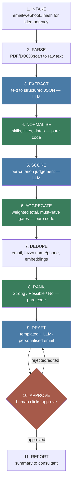

# Architecture

## Why the pipeline is split into eleven stages

The core design decision in this system: **the model makes one judgement at a time, and code does everything else.** Scoring maths, ranking, retries, deduplication logic — none of it is delegated to an LLM, because an LLM asked to do arithmetic or hold state across a batch is unreliable and unauditable. A director who disagrees with a shortlist needs a reason they can inspect, not "the model said so."

That split is why there are eleven stages instead of "an LLM reads the CV and returns a verdict." Three of them (NORMALISE, AGGREGATE, RANK) contain no LLM call at all, on purpose.

Blue = touches an LLM. Green = pure code, no LLM, deterministic and re-runnable. Orange = the human gate — nothing downstream of it happens automatically.

## Stage by stage

**1. INTAKE** — An email or webhook delivers attachments. Each file gets hashed on arrival so the same CV received twice (a candidate re-sending, a webhook retry) is recognised and not processed twice. No LLM.

**2. PARSE** — Convert whatever file format arrives (PDF, DOCX, scanned image) into raw text. `pdfplumber`/`PyMuPDF` for PDFs, `python-docx` for Word, Tesseract OCR for scans. No LLM — this is mechanical text extraction, and if it fails, the CV goes to the human review queue with a reason rather than being silently dropped (rule 6 in CLAUDE.md).

**3. EXTRACT** — LLM call. Raw CV text in, a schema-enforced JSON object out (the `CandidateProfile` shape already defined in `generate_cvs.py`: name, contact, employment history, education, skills, etc). This is the first LLM boundary and the one `evals/extraction_eval.py` will grade, because `data/ground_truth/` gives us the exact right answer for every synthetic CV.

**4. NORMALISE** — Pure code. Cleans up what extraction returns: skill synonyms ("JS" and "Javascript" are the same skill), job title normalisation, date parsing, computing employment gaps. Deterministic, no LLM, because this is lookup-table and string-parsing work — asking a model to do it would be slower, costlier, and less consistent. Confirmed by the Day 2 eval (`docs/LEARNING.md`): asking extraction to also estimate `total_years_experience` scored 74.2%, the one real weak point in an otherwise near-perfect run, because it's arithmetic over `employment[].start`/`end` dates, not something stated verbatim in the CV. This stage exists specifically to compute that kind of value in code instead.

**5. SCORE** — LLM call, but narrow. For one candidate against one rubric criterion at a time, the model returns a verdict (pass/fail or a rating), a confidence, and a quoted piece of evidence from the CV. It does not produce a final score — that would mean re-running the whole judgement to check its own maths, and it would drift between runs. One criterion in, one verdict out, repeated per criterion. Every open-ended employment date ("... - Present") needs today's date given to the model explicitly, confirmed by a Day 3 bug (`docs/LEARNING.md`): without it, the model silently guesses its own notion of "now" rather than computing the real span.

**6. AGGREGATE** — Pure code, not yet built. Takes all the per-criterion verdicts from SCORE and does the arithmetic: binary gates for must-haves (any failed must-have caps the candidate, however good the rest of the CV is), weighted sum for nice-to-haves. Weights live in editable rubric config so an agency can tune them without a code change.

**Known open problem for AGGREGATE, found on Day 3:** "Right to work in the UK" is a must-have on every role, but it has zero textual evidence in any CV — that's realistic (it's normally an application-form question, not something a CV states), but it means SCORE fails it for every candidate without exception, including perfect ones. Gating on "all must-haves pass" without changing this would auto-reject 100% of applicants on a criterion the CV was never going to answer. AGGREGATE (or something upstream of it) needs to source this must-have from a different signal, not from SCORE's CV-only judgement.

**7. DEDUPE** — Catches the same person applying to multiple roles under slightly different details (a shortened name, a different email — see the duplicate-planting logic in `generate_cvs.py`). Cascades from cheap to expensive: exact email match and fuzzy name+phone matching first (pure code, effectively free even at scale), then embedding-based content similarity to confirm or reject what the cheap stage flagged. Embeddings are not optional here, confirmed by measurement (`docs/LEARNING.md` Day 4): fuzzy name+phone alone, run across all 62 synthetic candidates, flagged 207 pairs for only 6 real duplicates — a 97% false-positive rate, because names and phone numbers collide between genuinely unrelated people far more than intuition suggests (24 different fake candidates all named "Oliver Vance" in this dataset alone). The embedding step compares actual CV content, not contact details, and cleanly separated true duplicates (similarity 1.0000) from same-named strangers (similarity ≤ 0.9958) — a real, wide gap, not a fuzzy judgement call.

**8. RANK** — Pure code. Sorts candidates into Strong / Possible / No using the AGGREGATE output, with the full per-criterion breakdown kept visible — nothing here is a black box the resourcer has to trust blindly.

**9. DRAFT** — LLM call, constrained. A response template is filled in with candidate-specific specifics (referencing what they actually offered, or what fell short). The email structure is templated code; the LLM only writes the personalised sentences.

**10. APPROVE** — The human gate. Nothing generated by DRAFT leaves this stage without an explicit click from someone at the agency. Every approval is logged: who, what, when. This exists because UK GDPR Article 22 restricts decisions made solely by automated means when they significantly affect someone — a rejection plausibly counts — and because it's the actual thing agencies are being sold: visible reasoning they can override, not a black box making the call for them.

**11. REPORT** — A summary back to the consultant: who got contacted, why, and what the system's confidence was. No LLM needed; this is formatting already-computed data.

## What "schema-enforced LLM call" means here

Every LLM boundary (EXTRACT, SCORE, DRAFT) uses a Pydantic model as the contract for what the model must return — the same pattern already used in `generate_cvs.py` for `CandidateProfile`. The API is asked to conform its output to that shape, so downstream code can trust the JSON structure without a parsing-and-hoping step. This is what CLAUDE.md means by "schema-enforced output, never prompt-and-parse."
